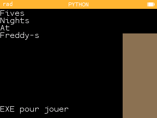

# [<Retour](../../ReadMe.md) | Five Nights At Freddy's 1
FNAF est un jeu d'horreur sorti le 8 août 2014 qui a connu son succès dans le mélange entre robots et horreur.

J'ai donc tenté de refaire une version **très** simplifiée de celui-ci à des fins de tests de la bibliothèque graphique laissée par NumWorks.

Le jeu est actuellement disponible mais assez peu intéressant face à la compréhension des évênements lié à l'UI auquel à accès l'utilisateur.

[➜ Découvrir](https://my.numworks.com/python/playidaill/fnaf)

## Apperçu

### Menu du jeu
 
Comme vous pouvez le remarquer, l'UI du jeu est vraiment simpliste, il a été créer plutôt dans le but de découvrir les possibilitées de la version de Python sur NumWorks.

##

Projet réalisé par Idnewaill