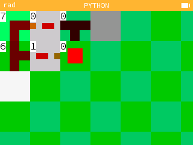

# [<Retour](../../ReadMe.md) | Redstone Minecraft
Il s'agit d'un simple constructeur de redstone fonctionnelle sur une petite map, encore une fois très lent sur la version en ligne du projet.

[➜ Découvrir](https://my.numworks.com/python/playidaill/redstone)

## Apperçu
Exemple de boucle allumant tour à tour les deux lampes (carrés blancs) présents sur la Map.

##

Projet réalisé par Idnewaill
