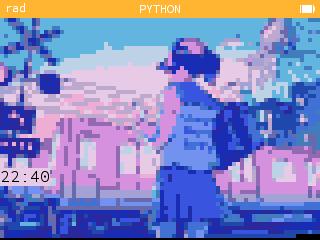
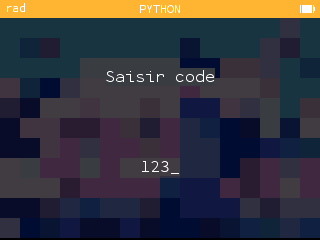
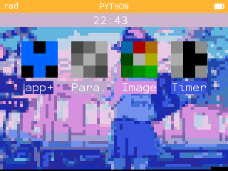
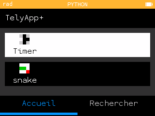

# [<Retour](../ReadMe.md) | Tely 4

Réplique fonctionnelle de téléphone sur NumWorks

## Requiert
Il est nécessaire de télécharger tous les [fichiers](../Tely4/) présents pour faire fonctionner le téléphone (depuis le pc après l'installation du module python "kandinsky" par la commande **'pip install kandinsky'**)

Si vous souhaitez l'installer directement depuis votre NumWorks, rendez vous sur ce site : 
[➜ Découvrir](https://my.numworks.com/python/playidaill/tely4)  
Vous y retrouverez 2 autres fichiers à importer sur votre calculatrice en suivant les liens présents sur la page.

## Comment utiliser ?
Ce qu'il faut savoir
- Le code par défaut est 4123.
- EXE sert à faire Retour/Éteindre
- Ok sert à passer à la suite
- Le boutton retour n'est pas à utiliser car il interrompt le script.

Comment le lancer ?
> Lancer le script [tely4](./tely4.py) en ayant les 3 fichiers .py dans le même répertoire.

## Apperçu

### Début
Dans un premier temps, vous arriverez sur cette interface, appuyer sur 'OK' pour continuer.

### Mot de passe
Vous devrez bien sûr entrer votre code (par défaut 4123 mais il est encodé pour le retouver plus difficilement).

### Menu
Ensuite, vous arriverez dans le menu où vous pouvez retrouver les applications téléchargées par défaut.

### TelyApp+
Si jamais vous ne trouvez pas votre bonheur à propos des applications disponibles, vous pourrez toujours retrouver d'autres applications dans le TelyApp+ (Bibliothèque d'applications avec réplique de téléchargement).

## Ressources

Voici une des ressources que j'ai fait à part avant de relier le tout.

- Application Affichage Icone 
[➜ Jeter un coup d'oeil](https://my.numworks.com/python/playidaill/icon)

##

Projet réalisé par Idnewaill