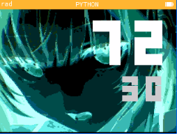

# [<Retour](../ReadMe.md) | Tely 9

Réplique fonctionnelle de téléphone sur NumWorks

Cette version n'est disponible qu'en tant que prototype car jugée trop lourde pour exister.

## Tester prototype
Pour cette version, vous pouvez simplement tester depuis le site officiel de NumWorks.

[➜ Tester en Ligne](https://my.numworks.com/python/playidaill/tely9)

## Ressources

Voici quelques ressources que j'ai créer avant de mettre le tout ensemble :
-  Générateur de texte dédié à l'affichage de l'heure 
[➜ Jeter un coup d'oeil](https://my.numworks.com/python/playidaill/draw_chiffres)

- Générateur d'arc de cercles avec rayures 
[➜ Jeter un coup d'oeil](https://my.numworks.com/python/playidaill/draw_arc_cercle)

##

Projet réalisé par Idnewaill